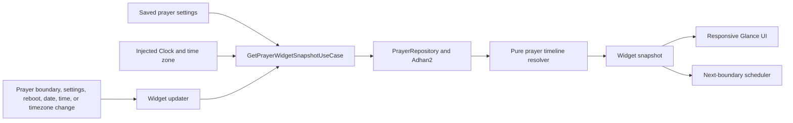

# Prayer Times App Widget — TDD Implementation Plan

## Goal

Create an Android home-screen widget that displays:

- All five daily prayer times where space permits.
- The next upcoming prayer.
- A live countdown to that prayer.
- Correct data after midnight, after Isha, and when settings or system time change.

The feature will be delivered in five TDD stages. Each stage begins with failing tests, adds only enough implementation to pass, and ends with refactoring while the tests remain green.

## Current implementation findings

Prayer times are already calculated offline by `PrayerRepositoryImpl` using Adhan2:

1. Read the saved latitude, longitude, Madhab, and calculation method.
2. Pass them and a `LocalDate` to Adhan2.
3. Return five `Prayer` objects containing absolute `Instant` values.
4. Select the first prayer whose time is strictly later than the current instant.
5. When no prayer remains today, calculate tomorrow and return tomorrow's Fajr.

The current next-prayer comparison is effectively:

```kotlin
prayersToday.firstOrNull { prayer.time > now }
```

This is a suitable definition for **next upcoming prayer**. “Closest prayer” should not mean the mathematically nearest prayer, because that could select a prayer that has already passed.

### Risks that must be addressed

- `HomeViewModel` and `FullPrayerTimesViewModel` cache `today` when they are created. A long-lived instance can continue using yesterday's date after midnight.
- At the exact prayer instant, the current strict comparison immediately advances to the following prayer. This behavior must be explicit and tested.
- After Isha, the next prayer is tomorrow's Fajr. Highlighting only by prayer name can incorrectly highlight today's already-passed Fajr.
- An unset location currently falls back to `(0.0, 0.0)`, which can generate believable but incorrect prayer times.
- `observePrayerSettings()` defaults to the Egyptian calculation method, while `observeAppSettings()` defaults to Muslim World League.
- The project currently has no `src/test` or `src/androidTest` test suites and no configured test dependencies.
- The manifest listens for time and timezone broadcasts, but `BootReceiver` currently ignores everything except `BOOT_COMPLETED`.
- The in-app countdown uses a coroutine that wakes every second. An app widget must not depend on that view-model job or on the app process remaining alive.
- Disabled Azan notifications currently mean that prayer's Azan alarm is not scheduled. Widget transitions must remain independent of notification preferences.

## Recommended architecture



The widget should consume one immutable result rather than directly using a view model:

```kotlin
data class PrayerWidgetSnapshot(
    val status: PrayerWidgetStatus,
    val prayers: List<Prayer>,
    val displayedDate: LocalDate,
    val nextPrayer: Prayer?,
    val remainingDuration: Duration,
    val targetInstant: Instant?,
    val location: Location?,
    val language: AppSettings.Language,
    val timeZone: TimeZone,
)
```

The widget must not depend on an in-memory coroutine loop, a screen view model, or hidden calls to the system clock.

---

## Stage 1 — Finalize the widget design and behavior contract

Start from `design/prayer-widget-design.png`. The design is a useful visual direction, but it contains more information than a typical widget size can display.

### Responsive variants

- **Compact, approximately 2×2:** next prayer, prayer time, and countdown.
- **Medium, approximately 4×2:** next prayer, countdown, and a compact five-prayer timeline.
- **Large, approximately 4×3 or 4×4:** the complete design with all five prayers and the upcoming prayer highlighted.

Launcher cell dimensions differ between devices. The implementation should use responsive dp size buckets rather than assuming exact cell dimensions.

### Required visual states

- Ready.
- Location not configured: “Open the app to set your location.”
- Prayer calculation error.
- Exact-alarm permission missing.
- Arabic RTL.
- English LTR.
- Before Fajr.
- Between prayers.
- After Isha, showing tomorrow's schedule with a clear “Tomorrow” label.
- Resized layouts and large font scale.

### Behavior decisions

- “Next prayer” means the first prayer strictly after `now`.
- At exactly Fajr, the widget switches to Dhuhr.
- Sunrise is excluded because the domain model and supplied design contain the five obligatory prayers only.
- After Isha, display tomorrow's five prayer times instead of highlighting today's past Fajr.
- The gold circular line represents elapsed progress between the previous and upcoming prayers. It advances through battery-safe 15-minute widget refreshes while the embedded chronometer continues updating every second.
- Android's live chronometer naturally displays `MM:SS` or `H:MM:SS`; it does not guarantee the design's leading hour zero.
- Tapping the widget opens the full prayer-times screen.
- The widget follows the selected app language.
- Decide during design approval whether prayer times remain in the app's existing 12-hour format or follow the device's 12/24-hour preference.

### Test plan

Create a design acceptance matrix before production implementation:

- Compact, medium, and large sizes.
- Ready, setup, error, and permission states.
- Arabic and English.
- Light and dark launcher backgrounds.
- Font scale 1.0 and at least 1.3.
- API 26, 31, and 36 screenshots.
- No clipped prayer names, countdown values, icons, or AM/PM labels.
- Touch target and content-description review.

### Exit criterion

The responsive designs and all behavior decisions are approved, and every visual state has an expected reference image or written acceptance rule.

---

## Stage 2 — Build and test a pure prayer timeline engine

Introduce an injectable clock and timezone provider. Create a pure resolver that accepts `now`, today's prayers, and tomorrow's prayers.

### Selection algorithm

```kotlin
val now = clock.now()
val zone = widgetTimeZone()
val today = now.toLocalDateTime(zone).date

val todayPrayers = repository
    .getDailyPrayers(settings, today)
    .sortedBy { it.time }

val nextPrayerToday = todayPrayers
    .firstOrNull { it.time > now }

val result = if (nextPrayerToday != null) {
    TimelineResult(
        displayedDate = today,
        displayedPrayers = todayPrayers,
        nextPrayer = nextPrayerToday,
    )
} else {
    val tomorrow = today.plus(1, DateTimeUnit.DAY)
    val tomorrowPrayers = repository
        .getDailyPrayers(settings, tomorrow)
        .sortedBy { it.time }

    TimelineResult(
        displayedDate = tomorrow,
        displayedPrayers = tomorrowPrayers,
        nextPrayer = tomorrowPrayers.first { it.name == PrayerName.FAJR },
    )
}

val remaining = maxOf(
    result.nextPrayer.time - now,
    Duration.ZERO,
)
```

Always compare `Instant` values. Convert them into localized strings only after the correct prayer has been selected. This prevents selection errors during daylight-saving transitions and repeated local clock hours.

### Unit tests written first

- Before Fajr selects Fajr.
- One millisecond before Fajr selects Fajr with 1 ms remaining.
- Exactly Fajr selects Dhuhr.
- One millisecond after Fajr selects Dhuhr.
- Each interval between two prayers selects the later prayer.
- Exactly Isha selects tomorrow's Fajr.
- After Isha selects tomorrow's Fajr and tomorrow's displayed prayer list.
- Exactly local midnight uses the new local date.
- Unsorted prayer input is handled deterministically.
- Empty today's list returns a controlled error.
- Empty tomorrow's list returns a controlled error.
- Duplicate prayer instants are handled deterministically or rejected.
- Remaining duration is never negative.
- Upcoming highlighting compares the prayer instant/date as well as its name.

### Prayer repository integration tests

- Fixed Cairo coordinates, date, Egyptian method, and Shafi Madhab produce a deterministic fixture.
- Returned prayers are ordered Fajr, Dhuhr, Asr, Maghrib, Isha by instant.
- Every calculation-method mapping returns a usable result.
- Hanafi and Shafi produce the expected Asr difference for a known fixture.
- An after-Isha query returns the following date's Fajr.
- Valid latitude and longitude boundaries work.
- NaN, infinity, latitude outside `-90..90`, and longitude outside `-180..180` are rejected.
- High-latitude calculation failures become controlled domain errors rather than widget crashes.

### Exit criterion

The resolver and Adhan2 integration suite pass on the JVM without any Android widget code.

---

## Stage 3 — Implement and test the widget snapshot use case

Create a coordinator such as `GetPrayerWidgetSnapshotUseCase`.

### Responsibilities

1. Read one consistent prayer-settings source.
2. Validate that a location has genuinely been configured.
3. Read the current instant and timezone together.
4. Derive the current local date for every request rather than caching it.
5. Call the prayer timeline engine.
6. Map the result into presentation-ready widget state.
7. Return explicit `Ready`, `NeedsLocation`, `PermissionRequired`, and `Error` states.

Normalize the inconsistent default calculation methods before allowing the widget to depend on the settings repository.

### Location and timezone contract

The current `Location` model contains no timezone ID. Manually selecting a distant city while the device remains in Cairo can therefore format that city's calculated prayers in the device timezone.

Choose one explicit policy:

- **Recommended long-term policy:** persist a timezone ID with every selected location.
- **Smaller initial scope:** document that prayer times use the device timezone, matching the current app behavior.

Do not silently mix a manually selected city's coordinates with an unrelated device timezone without defining the expected behavior.

### Unit tests written first

Use fake settings and prayer repositories plus a fake clock:

- Reads location, Madhab, calculation method, language, and timezone once per snapshot.
- Unconfigured location returns `NeedsLocation` rather than calculating at `(0.0, 0.0)`.
- A legitimate `(0.0, 0.0)` location can only be accepted when an explicit “location configured” flag exists.
- Changing location recalculates the entire snapshot.
- Changing Madhab recalculates Asr.
- Changing calculation method recalculates the prayer list.
- Moving the clock forward or backward recomputes the target.
- Changing timezone recomputes local date and formatted prayer times.
- DST spring-forward and fall-back cases still select prayers using `Instant`.
- Arabic produces localized prayer names and RTL state.
- Noon and midnight use correct AM/PM or 24-hour formatting.
- Repository exceptions return a controlled error snapshot.
- Two calls on opposite sides of midnight do not retain a stale date.

### Exit criterion

For any fake clock and settings combination, the use case returns a deterministic, complete widget snapshot.

---

## Stage 4 — Build the responsive widget and live countdown

Use Jetpack Glance for the responsive widget layout, with an embedded XML `RemoteViews` chronometer for the live seconds counter.

Glance fits the existing Compose-based project and can select responsive content based on the widget's available size. `AndroidRemoteViews` can host the chronometer that Glance does not update every second itself.

### Countdown implementation

Do not request a widget update every second. App widgets are passive, their process can disappear, and frequent redraws would waste battery.

The countdown ring is calculated from the complete previous-prayer-to-next-prayer interval. It is
empty at the previous prayer, fills clockwise as the remaining duration decreases, and is full at
the target. Because `RemoteViews` cannot bind a determinate ring to `Chronometer`, the ring refreshes
approximately every 15 minutes through one unique WorkManager job. A single widget-only exact alarm
refreshes all instances at the prayer boundary and resets the ring for the following interval.

Calculate the chronometer base using elapsed realtime:

```kotlin
val remainingMillis =
    targetInstant.toEpochMilliseconds() - clock.now().toEpochMilliseconds()

val chronometerBase =
    SystemClock.elapsedRealtime() + remainingMillis.coerceAtLeast(0L)
```

Configure the remote view with countdown mode enabled:

```kotlin
remoteViews.setChronometer(
    R.id.prayer_countdown,
    chronometerBase,
    null,
    true,
)
remoteViews.setChronometerCountDown(
    R.id.prayer_countdown,
    true,
)
```

The chronometer base must use `SystemClock.elapsedRealtime()`. Passing the prayer's epoch milliseconds directly would produce an incorrect timer.

### Planned widget resources

- `PrayerTimesWidget` Glance implementation.
- `PrayerTimesWidgetReceiver`.
- Widget provider XML.
- Loading and preview layouts.
- XML chronometer fragment.
- Compact, medium, and large Glance composables.
- Widget-specific colors, shapes, dimensions, drawables, and strings.
- Content descriptions and test tags.
- Pending intent or deep link to the full prayer-times screen.
- API 31+ rounded-corner behavior and older API fallback.
- Widget picker name, description, `previewLayout`, and `previewImage`.

Use a stable Glance version compatible with the project's Kotlin and Android Gradle Plugin versions. Do not adopt an alpha version solely for this feature.

### UI tests written first

- Ready state contains the next-prayer name, prayer time, and countdown.
- Compact layout omits the full five-prayer row.
- Medium and large layouts show the expected amount of information.
- Large layout contains exactly five prayer items.
- Exactly one future prayer instant is highlighted.
- After Isha shows tomorrow's prayer list and label.
- Setup state contains the correct open-app action.
- Error state contains the correct fallback and retry action.
- Widget click opens the expected activity or deep link.
- Robolectric test verifies the chronometer base formula.
- Remote view is in countdown mode and started only for a valid future target.
- Missing exact-alarm permission does not start an unsafe live timer.

### Screenshot and device tests

- API 26, 31, and 36.
- Compact, medium, and large sizes.
- Arabic and English.
- Light and dark wallpapers.
- Large font scale.
- Long prayer-name and localized-number handling.
- Real launcher smoke test because Glance node tests do not verify final rendered pixels.

### Exit criterion

The widget can be added, resized, localized, and tapped. Its live countdown is driven by the launcher without waking the app process every second.

---

## Stage 5 — Prayer-boundary updates and lifecycle hardening

An Android `Chronometer` continues after zero and can show a negative value. The widget must therefore refresh at each prayer boundary.

Harden the widget-specific boundary scheduler introduced for countdown-ring transitions. It remains
independent of Azan notification settings.

### Boundary update sequence

1. Build and render the current snapshot.
2. Schedule one update at the selected prayer instant.
3. At the boundary, recompute the snapshot.
4. Update every installed widget instance.
5. Schedule the following prayer boundary.
6. Schedule a local-midnight refresh so the full prayer list changes date correctly.

Do not rely exclusively on current Azan alarms. Disabled prayer notifications must not disable widget transitions.

### Required update triggers

- Widget added or enabled.
- Widget resized.
- Prayer boundary.
- Local midnight.
- Location changed.
- Madhab changed.
- Calculation method changed.
- App language or time format changed.
- Manual widget refresh.
- Device reboot.
- App/package update.
- `TIME_SET`.
- `TIMEZONE_CHANGED`.
- `DATE_CHANGED`.
- Locale change.
- App restore or widget-host recreation.

Receiver routing must be corrected so that manifest-declared system events are not discarded.

### Exact-alarm fallback

The app declares `SCHEDULE_EXACT_ALARM`, but permission can be denied.

- **Permission granted:** show the live chronometer and schedule an exact prayer-boundary transition.
- **Permission denied:** show the next prayer and its clock time, plus an “Enable live countdown” action. Do not allow the chronometer to run negative while presenting it as accurate.
- Use an infrequent periodic update only as a recovery mechanism, not as the countdown engine.

### Scheduler unit tests written first

- Only one boundary alarm is active for the widget set.
- Rescheduling cancels the old target.
- Disabled Azan notification does not disable widget boundary scheduling.
- Boundary receiver updates all widget instances.
- After Isha, the scheduled target is tomorrow's Fajr.
- Midnight refresh switches the displayed date and list.
- Reboot recreates elapsed-realtime bases.
- Manual clock and timezone changes invalidate and rebuild the timer base.
- Missing exact-alarm permission never throws `SecurityException`.
- Removing the final widget cancels widget-only scheduling.
- Multiple widget instances remain consistent.
- Duplicate broadcasts are idempotent.

### Integration and resilience tests

- Process death followed by a system widget update.
- Device reboot.
- Doze and battery saver.
- Package upgrade.
- Launcher restart and widget restoration.
- Clock moved forward across a prayer.
- Clock moved backward before the current target.
- Timezone changed across the international date line.
- Settings changed while the app is in the foreground.
- Location permission denied after a location was previously saved.
- At least one Pixel launcher and one OEM launcher.

### Exit criterion

The widget remains correct across prayer transitions, midnight, reboot, process death, settings changes, and time or timezone changes, without depending on Azan notification preferences.

---

## Complete edge-case matrix

### Prayer boundaries

- Before Fajr.
- Exactly Fajr, Dhuhr, Asr, Maghrib, and Isha.
- One millisecond before and after every prayer.
- After Isha.
- Exactly local midnight.
- Tomorrow's Fajr after midnight.

### Date and time

- DST missing hour.
- DST repeated hour.
- Manual clock forward.
- Manual clock backward.
- Timezone changed without changing the absolute instant.
- Reboot resetting elapsed realtime.
- Device timezone differing from manually selected city.

### Settings and data

- No configured location.
- `(0.0, 0.0)` ambiguity.
- Invalid coordinates.
- Calculation method changed.
- Madhab changed.
- Language changed.
- High-latitude calculation failure.
- Empty, unsorted, or duplicate prayer data.

### Widget lifecycle

- First widget added.
- Multiple widget instances.
- Resize between every supported bucket.
- Final widget removed.
- Process killed.
- Launcher restarted.
- Package upgraded.
- Exact-alarm permission granted, revoked, or denied.
- Battery saver and Doze.

### Presentation

- Arabic RTL and English LTR.
- 12-hour and 24-hour formats.
- Noon and midnight.
- Large font scale.
- Narrow launcher cells.
- Light and dark wallpapers.
- Long localized content descriptions.

## Test suite organization

Suggested test structure:

```text
app/src/test/
├── domain/prayer/PrayerTimelineResolverTest.kt
├── domain/prayer/GetPrayerWidgetSnapshotUseCaseTest.kt
├── data/prayer/PrayerRepositoryImplTest.kt
├── presentation/widget/PrayerWidgetMapperTest.kt
├── presentation/widget/PrayerWidgetSchedulerTest.kt
└── presentation/widget/PrayerWidgetGlanceTest.kt

app/src/androidTest/
├── presentation/widget/PrayerWidgetScreenshotTest.kt
├── presentation/widget/PrayerWidgetReceiverTest.kt
└── presentation/widget/PrayerWidgetIntegrationTest.kt
```

Prefer fakes for the clock, settings repository, prayer repository, scheduler, and updater. Mock Android framework boundaries only where a fake wrapper is impractical.

## CI verification

The widget feature should add these gates:

```bash
./gradlew testDebugUnitTest
./gradlew connectedDebugAndroidTest
```

If screenshot tests use a separate verification task, CI must run it with a fixed emulator configuration and fail on unapproved visual differences.

## Definition of done

The feature is complete only when:

- One tested timeline implementation drives prayer selection.
- No widget logic uses a cached date.
- Invalid or unconfigured location never displays fabricated prayer times.
- After-Isha behavior clearly uses tomorrow's Fajr and tomorrow's schedule.
- The countdown does not request one app-driven widget update per second.
- Prayer transitions work when Azan notifications are disabled.
- Reboot, midnight, clock, timezone, settings, language, resize, and permission changes are handled.
- Compact, medium, and large layouts pass English and Arabic visual tests.
- Exact-alarm denial has an explicit safe fallback.
- All five TDD stages and CI verification tasks are green.

## Reference documentation

- [Manage and update Glance app widgets](https://developer.android.com/develop/ui/compose/glance/glance-app-widget)
- [Create an app widget with Glance](https://developer.android.com/develop/ui/compose/glance/create-app-widget)
- [Glance and RemoteViews interoperability](https://developer.android.com/develop/ui/compose/glance/interoperability)
- [Unit testing with Glance](https://developer.android.com/develop/ui/compose/glance/testing)
- [Responsive app widget layouts](https://developer.android.com/develop/ui/views/appwidgets/layouts)
- [RemoteViews chronometer API](https://developer.android.com/reference/android/widget/RemoteViews)
- [Android Chronometer API](https://developer.android.com/reference/android/widget/Chronometer)
- [Schedule alarms](https://developer.android.com/develop/background-work/services/alarms)
